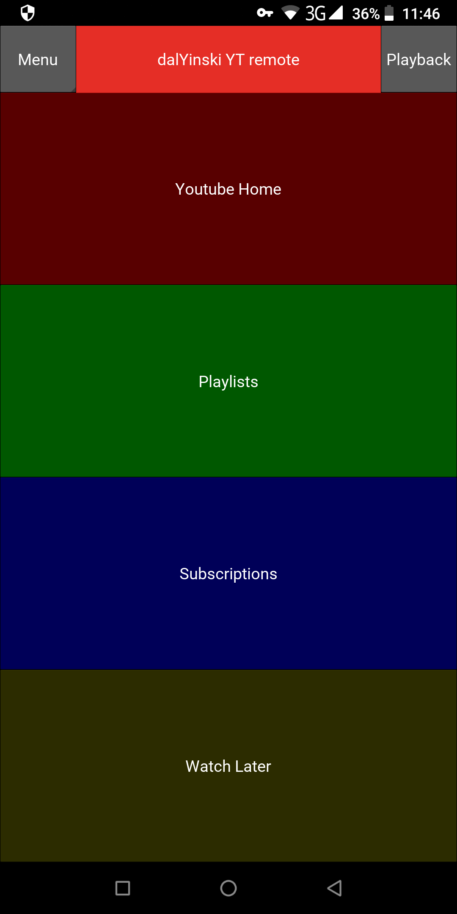
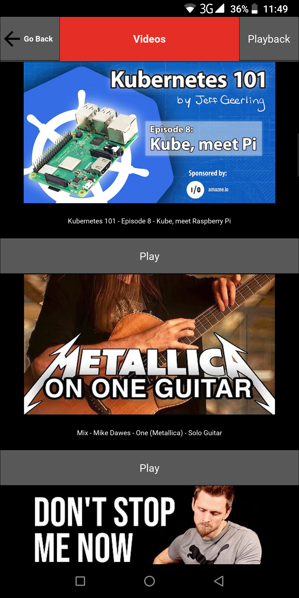
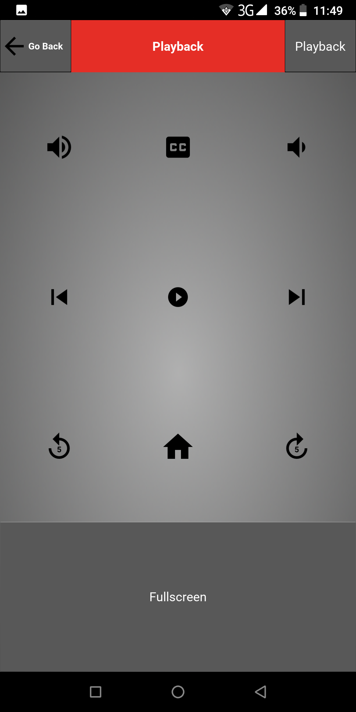

# Installation
1. Install Firefox

2. Create new firefox profile

In URL bar type "about:config" and click "Create a New Profile". Name it "selenium".
Then click "Launch profile in new browser" and navigate to Youtube and login with your
credentials. 

3. [Download and install server part](https://friendlytroll.github.io/dalYinski/)

4. Install Android app

5. Click on "Start server and open browser"

After starting the app on windows you may get a popup Windows Security Alert window. Check the box "Private networks, such as my home or work network".

You should now be able to browse videos with the Android app.

**Make sure the Firefox window remains open while you are using the app!**

# Development Dependencies
## Linux
### GUI
- Python 3.8.5 (should already be installed on Ubuntu 20.04)
- python3-selenium (Ubuntu 20.04 package)
- python3-wxgtk4.0 (Ubuntu 20.04 package)

Install above via:
`sudo apt install python3-selenium python3-wxgtk4.0`

### Android Kivy app
For android part create new virtualenv and install from requirements.txt file.

    python3 -m venv myvenv
    source myvenv/bin/activate
    pip3 install -r requirements.txt

## Windows 10
### GUI
- Python 3.8.5
 
Install from win-requirements.txt.

    python -m venv myvenv
    venv\Scripts\activate.bat
    pip3 install -r win-requirements.txt

### Android Kivy app

    pip3 install -r requirements.txt

# Icons and resources used
* Android icon: "File:B&W YouTube icon.png" by Rodrigo.Argenton is licensed under CC0 1.0
* Other icons: https://material.io/resources/icons/?style=baseline

# Screenshots

